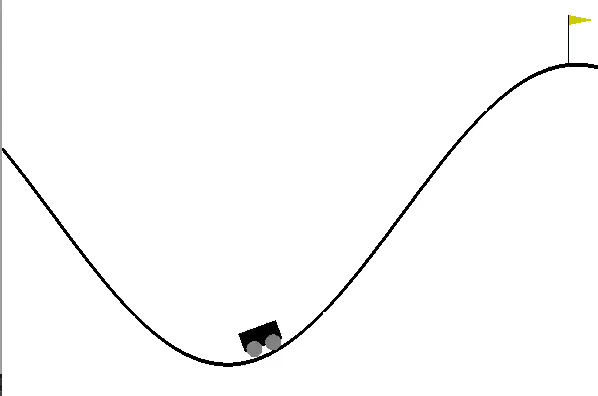

# mountainCar_openAi

### About
This is a challenge from opened where you are supposed to create a learning algorithm to get the car to the flag. 
The problem is that it´s engine are to weak to take it right away so it have to learn to go back and then try to catch it.

### Solution
My solution to this problem was to implement the famous Q-learning algorithm and this was with a success. 
Got a finished solution as fast as 20-50 episodes and a consistent in around 100-150 depending on luck with the learning period. 
